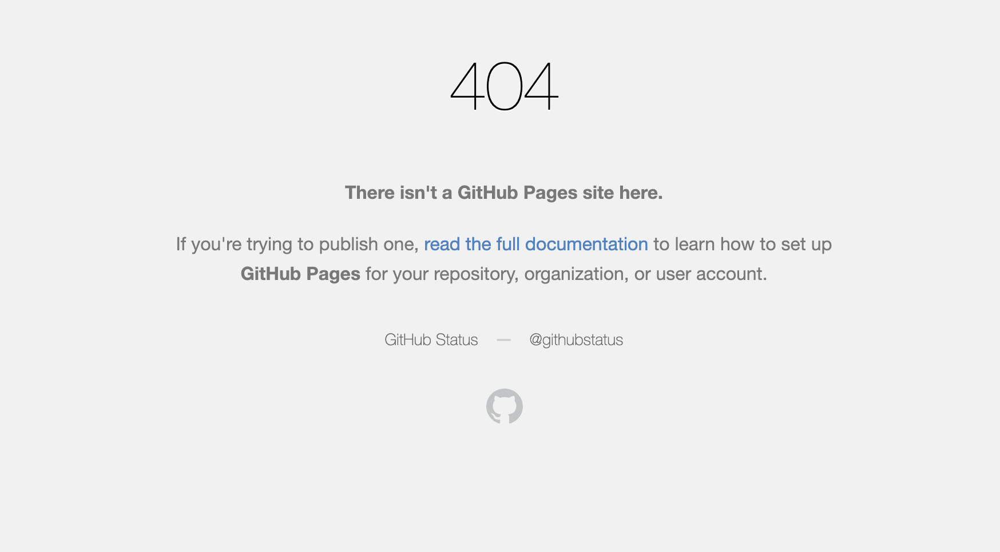

# Accessibility-Enhancement
1. The Homework-1 is intended to refactor the existing code to improve accesibility by changing the sematic HTML elements and linking them to appropriate tags in Style.css sheet, correcting the indentation.
2. To link an image:

3. Link to deployed app: https://ir-p.github.io/Homework-1/
   
